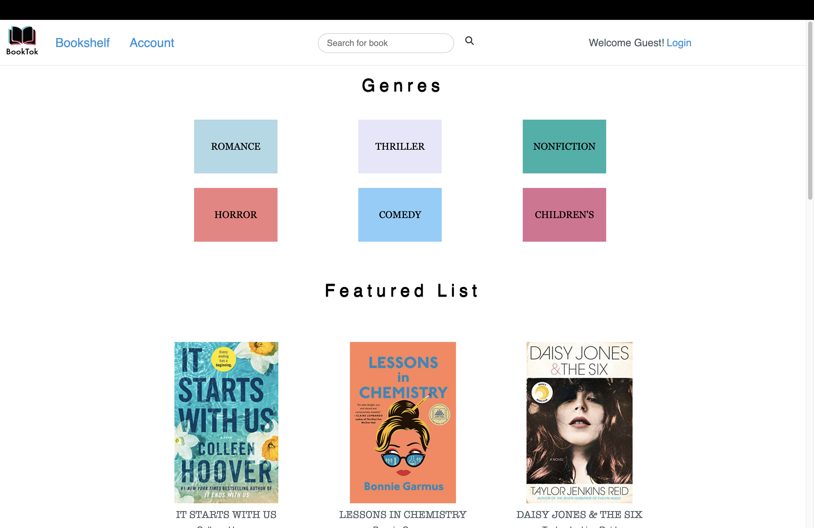
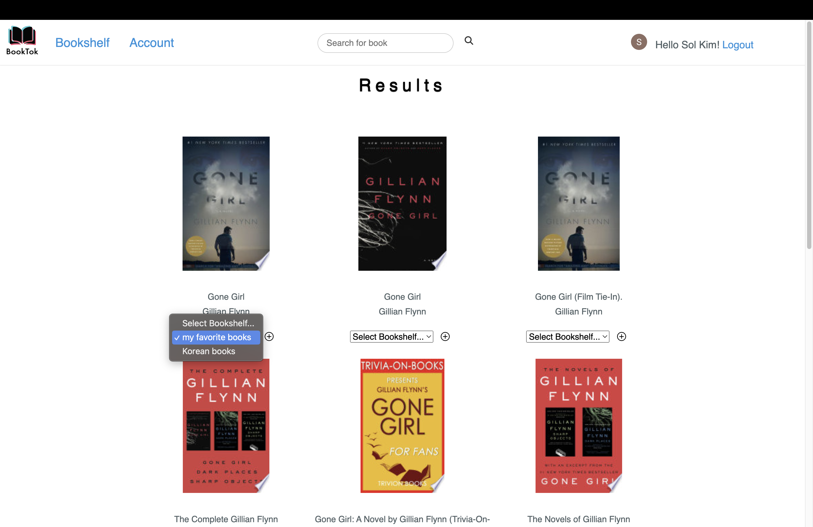
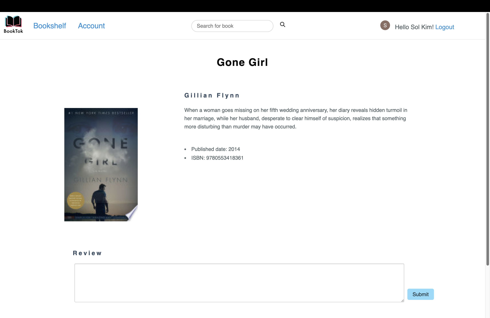

# BookTok

## About the project

This full-stack web application is designed for book discovery, tracking, and review-sharing.

### Key features:
* Login for user-specific features
* Recommend books based on some genres and The New York Times bestseller 
* Search books by title, author, and isbn
* Keep books on your bookshelf
* Share book reviews with other users

 

## Technologies

* Built with
Python, Flask, SQL(PostgreSQL), Javascript, HTML/CSS, Jinja, and PureCSS

* External dependencies:
Google Books API, The New York Times API, Auth0, PureCSS, and Font awesome

* Deployed with
[Render](https://render.com/)

## Link to Site
<https://booktok.onrender.com/>

